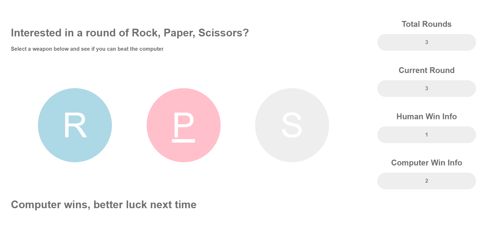
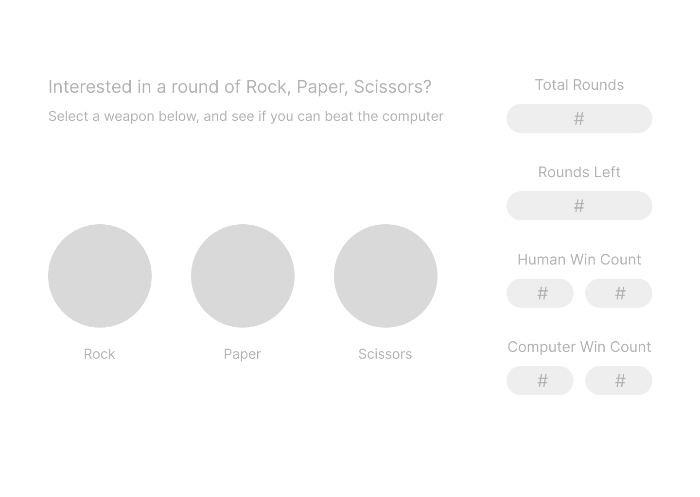

# The Odin Project - Rock, Paper, Scissors Solution 

This is a solution to the [Rock 🪨, Paper 📃, Scissors ✂️ challenge on The Odin Project](https://www.theodinproject.com/lessons/foundations-revisiting-rock-paper-scissors). The Odin Project is a free open-source coding curriculum that provides a comprehensive study path for aspiring developers. 

## Table of contents

- [Overview](#overview)
  - [Screenshot](#screenshot)
  - [Links](#links)
- [My process](#my-process)
  - [Built with](#built-with)
  - [What I learned](#what-i-learned)
  - [Continued development](#continued-development)
- [Author](#author)

**Note: Delete this note and update the table of contents based on what sections you keep.**

## Overview

### Screenshot

#### Final 
Final screen after playing a round 

#### Wireframe
Prototype for the general layout 

### Links

- Code URL: [https://github.com/colleennicole223/odin-rock-paper-scissors](https://github.com/colleennicole223/odin-rock-paper-scissors)
- Live Site URL: [https://colleennicole223.github.io/odin-rock-paper-scissors/](https://colleennicole223.github.io/odin-rock-paper-scissors/)

## My process

### Built with
- HTML
- CSS
  - Flex Containers 
- JavaScript 
  - Switch Statement
  - Event Listeners 
  - DOM manipulation

### What I learned

This project had me using DOM manipulation and Events for the first time. It was easier to understand the format once I had a better grasp on arrow functions. I attached event listeners to the rock, paper, and scissor button nodes to read the users selection. I enjoyed being able to directly target nodes with selectors and change their properties - this allowed me to change button colors based on human or computer selection.  

### Continued development

Need more practice with event listeners, with more experience I think I would have set this project up differently and could have added some more user-friendly features.  

## Author

- Personal Website - [Colleen Nicole](https://www.colleennicole.com)
- Project Website - [The Odin Project](https://www.theodinproject.com)

